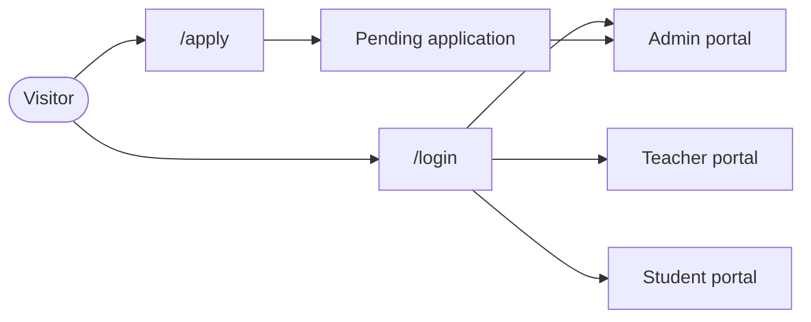
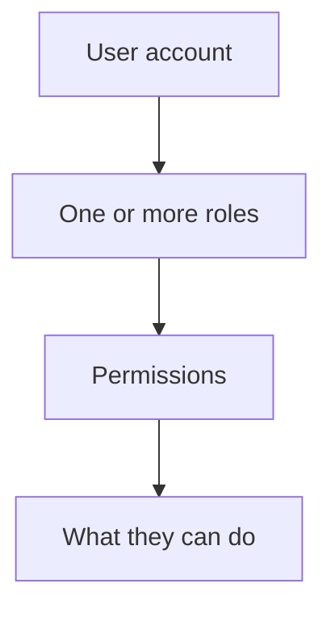
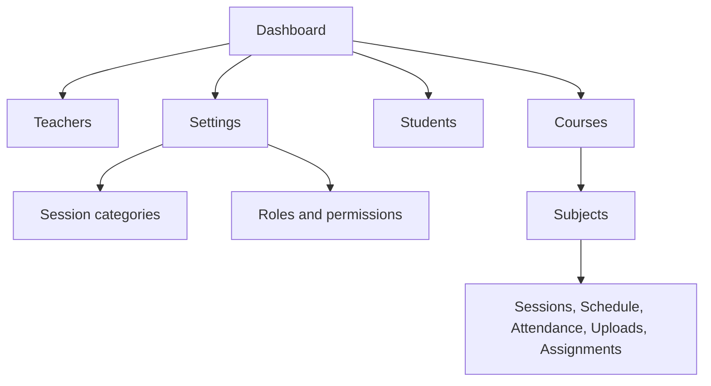
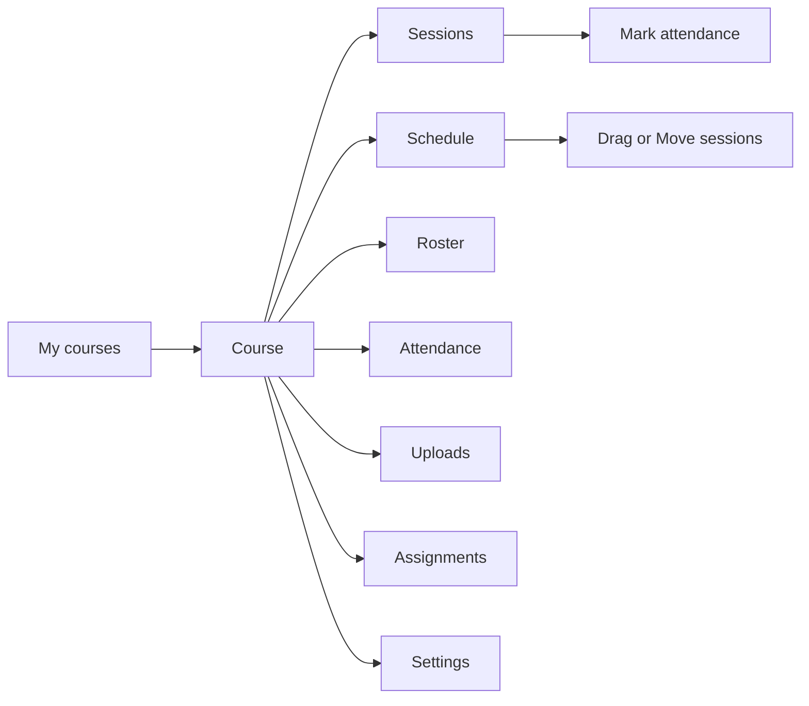
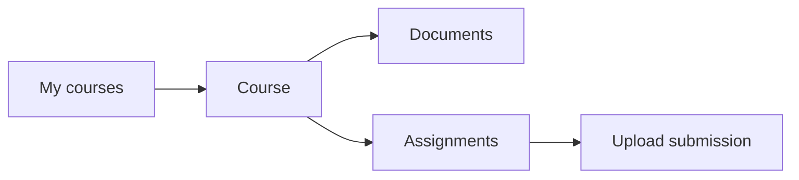
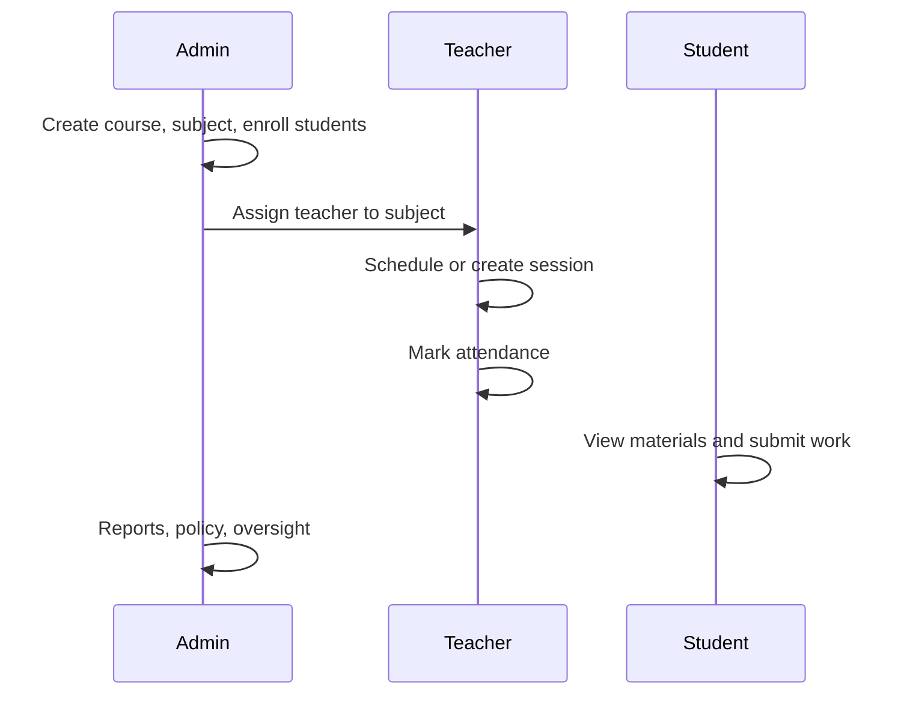
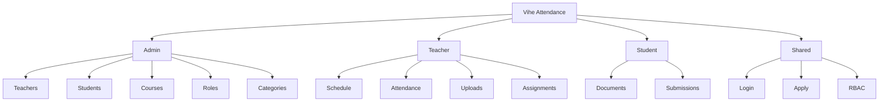

# Vihe Attendance — Product Overview

Short slide deck of what the app does today. Use for walkthroughs.

---

## 1. What it is

**Vihe Attendance** is the portal for VIHE courses:

- Teachers mark class attendance and run the week schedule
- Admins manage people, courses, roles, and settings
- Students view courses, download materials, and submit assignments

Built for Vrindavan Institute for Higher Education.

---

## 2. Who uses it

| Portal | Typical user | Entry |
| --- | --- | --- |
| Admin | Institute staff | `/admin` |
| Teacher | Assigned instructors | `/teacher` |
| Student | Enrolled learners | `/student` |
| Apply | Prospective students | `/apply` |

---

## 3. How access works

Permissions are **not** hardcoded role names. Admins configure a matrix:

- **Permission** — atomic capability (e.g. `attendance.mark`, `courses.manage`)
- **Role** — named bundle (`Admin`, `Teacher`, or custom)
- **User** — holds one or more roles

Seeded system roles: **Admin**, **Teacher** (not deletable; grants are editable).

---

## 4. Admin portal

**People**

- Teachers — create, archive, reset password, assign roles
- Students — create, enroll in courses, login expiry, archive
- Applications — approve / reject prospective students

**Courses**

- Create / archive courses and subjects
- Assign teachers to subjects
- Course roster, details, attendance policy
- Full classroom workspace (same tools teachers use)

**Settings**

- Session categories (e.g. Class, Temple) — min attendance %, allow files
- Roles & permissions matrix

---

## 5. Teacher portal

- Open only **assigned** courses / subjects
- Create sessions; mark Present / Absent / Late / Excused
- Week schedule — drag on desktop, **Move** + tap day on phone
- Roster enrollment (when permitted)
- Upload PDF/images to sessions; issue & grade assignments
- Mobile-friendly chrome; camera **Take photo** on uploads

---

## 6. Student portal

- Sign in with email + portal password set by admin
- View enrolled courses and session files
- Submit assignment work (PDF / images; camera on phone)
- Change own password

---

## 7. Attendance loop

Session categories can set a **minimum attendance %** used for at-risk flags on the roster.

---

## 8. Files & assignments

| Feature | Who | Notes |
| --- | --- | --- |
| Session resources | Teacher / Admin | PDF + images; category can disable files |
| Course uploads list | Teacher / Admin | All files across sessions |
| Assignments | Teacher issues → Student submits → Teacher grades | Multi-file; due date; max marks |
| Storage | Azure Blob (Azurite locally) | |

---

## 9. Sign-in & accounts

- Credentials login for all portals
- Optional Google sign-in **only if** an admin already created that email
- No public self sign-up — use **Apply** → admin approval
- Student login can expire (admin-set)
- Each portal has Account → change password

---

## 10. One-line map

---

*Living overview of current product scope — update when major features ship.*
